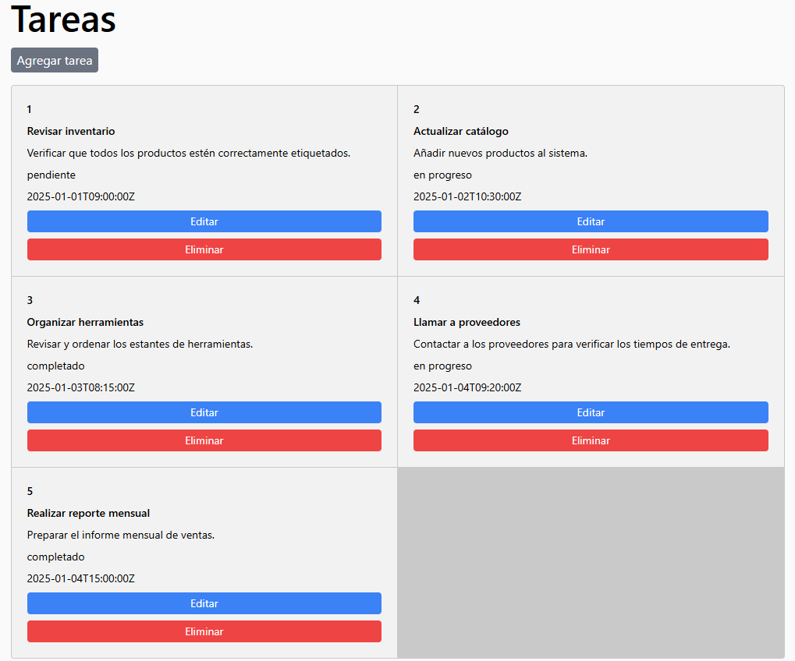

# Desarrollo Frontend con React

## Instrucciones:
Desarrollar una aplicación en React que consuma la API creada en la Parte 2.

## Requerimientos:
1. **Vistas requeridas:**
   - **Inicio de sesión:**
     - Permitir a los usuarios ingresar su correo y contraseña para autenticarse.
   - **Lista de tareas:**
     - Mostrar todas las tareas del usuario autenticado.
     - Incluir botones para editar el estado y eliminar tareas.
   - **Crear tarea:**
     - Formulario para agregar una nueva tarea.
2. **Extras:**
   - Usar React Router para manejar las rutas.
   - Estilizar la aplicación utilizando CSS, Bootstrap o una librería como Material-UI.

## Resultado:

### Inicio de sesión

  

### Lista de tareas

  

### Agregar nueva tarea

  

### Editar tarea

  

